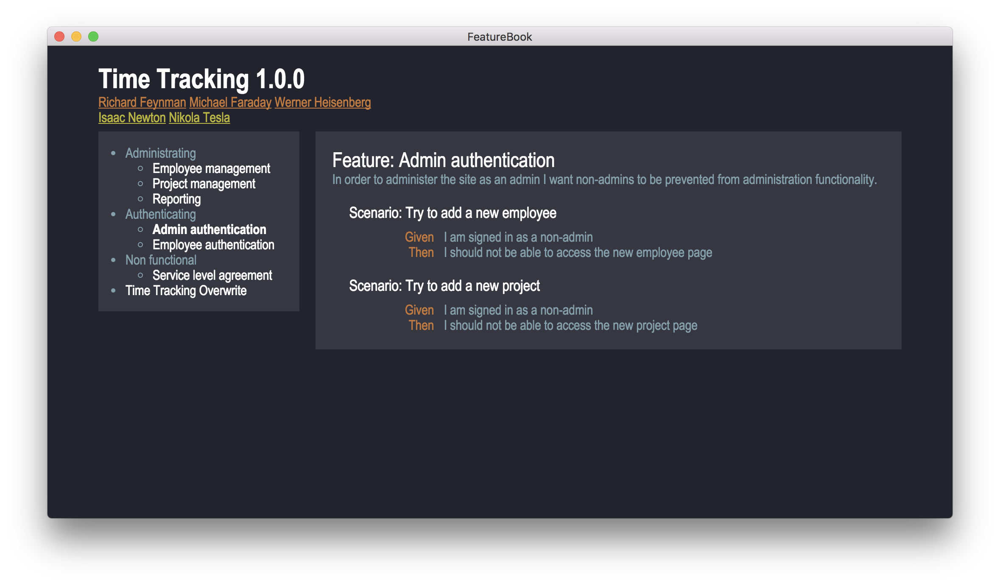

# featurebook-desktop

> FeatureBook Desktop Application

[](https://travis-ci.org/SOFTWARE-CLINIC/featurebook-desktop)
[](https://david-dm.org/SOFTWARE-CLINIC/featurebook-desktop)
[](https://codeclimate.com/github/SOFTWARE-CLINIC/featurebook-desktop)
[](https://codeclimate.com/github/SOFTWARE-CLINIC/featurebook-desktop/coverage)

## Running locally

```
$ npm install && npm start
```



## Links

1. https://github.com/electron-userland/electron-compile
